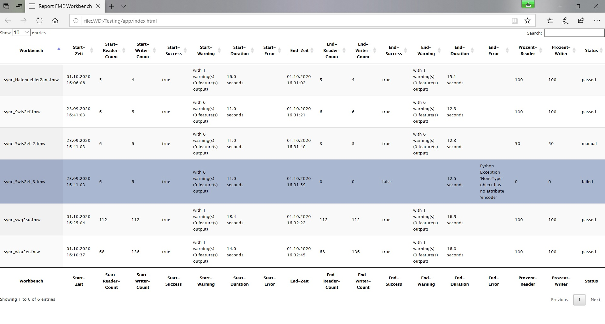

#

FME Workspace Testing
=====================

## Inhalt
* [Einleitung](#einleitung)
* [FME Test Workspace](#fme-test-workspace)
* [Python Package Tester](#python-package-tester)
* [Report WebApp](#report-webapp)
* [Summary](#summary)

## Einleitung
Auf Fehler und Probleme in einem ETL-Prozess stoßen wir i.d.R. erst zur Laufzeit. Innerhalb einer IT-Infrastruktur, die permanenten Änderungen unterliegt, deren Quell-Daten und -Dienste kontinuierlich weiterentwickelt werden, macht man sich irgendwann Gedanken darüber, wie man seine Prozesse automatisiert auf Funktionsfähigkeit testen kann. 

In diesem Beitrag geht es ausschließlich um das automatisierte Testen von FME-Workbenchs. Ansätze hierzu findet man bei [Modern geoSystems](https://www.safe.com/blog/2020/01/fme-hub-highlight-fme-test-framework/) sowie bei Veremes mit dem [rTest - Testing tool for FME workspaces](https://gitlab.veremes.net/open-source/rTest). Das rTest - Tool erscheint mir interessant. Hier werden in einem XML-File Test-Szenarien definiert, vielleicht am ehesten mit Unit-Tests zu vergleichen. Genauso wie bei Unit-Tests erfordert dies aber sehr viel Aufwand. Mir persönlich zu viel Aufwand. Deshalb habe ich einen einfacheren Ansatz gewählt, mit dem ich die grundlegende Funktionalität meiner FME-Workbenchs automatisiert testen kann. 

## FME Test Workspace
Um eine FME Workbench zu testen, müssen wir sie ausführen. Dabei wollen wir natürlich nicht in die Zieldatenbanken schreiben. Deshalb kopieren wir unsere fmw-Files in einen Testorder und ersetzen in jedem File, die Writer durch den Custom Transformer [Testing](fme), der letztendlich nur die zu schreibenden Objekte zählt und als *Total Count* in das Logfile schreibt. Dieses Logfile ist unser *Soll-Zustand*. Beim automatisierten Testen werden als erstes die Parameter aus diesem ursprünglichen Logfile eingelesen, dann wird die Test-Workbench erneut ausgeführt und die Parameter aus dem neuen Logfile mit dem Soll-Zustand verglichen.

## Python Package Tester
Der gesamte Prozess läuft auf Basis des kleinen python-packages 'tester',  welches zusammen mit einem Client im Ordner [src](src) zu finden ist.

Fassen wir noch einmal zusammen. Mit Python durchlaufen wir alle fmw-Files des Test-Ordners und 
* Lesen für jedes fmw-File das ursprüngliche Logfile ein (der fehlerfreien Transformation).
* Führen die FME-Workbench als Python *subprocess* aus.
* Lesen das neue Logfile ein und vergleichen seine Parameter mit dem *Soll-Zustand*.

Dabei begnügen wir uns mit den folgenden Parametern:
* Total Features Read
* Total `@Count' Invocations (*anstatt Total Features Written*)
* Translation Success (*Successful / Failed*)
* Anzahl Translation Warnings
* FME Session Duration
* Erster, verursachender Error
* Logfile Datum

Zusätzlich berechnen wir 2 neue Attribute, und zwar die relative Häufigkeit der gelesenen und der zu schreibenden Features im Vergleich zum Soll-Zustand. Die Gesamtklassifikation erfolgt im Attribut 'Status' (*passed, manual, failed*). Sämtliche Informationen werden in einem *pandas DataFrame* zwischengespeichert und zum Abschluss in eine Datei *testResult.json* geschrieben.

## Report WebApp
Mit der minimalen [HTML/JS-WebApp](app) wird das erzeugte JSON-File über eine 
[DataTables](https://datatables.net/) Instanz visualisiert. Die App sollte aufgrund der CORS Restriktion auf einem WebServer liegen.

Abb. 1: FME Test Report

## Summary
Mit der hier vorgestellten Lösung können FME Workspaces automatisiert auf ihre grundlegende Funktionalität getestet werden. Ob sich dieser Test-Ansatz auch in der Praxis bewährt, darüber werde ich in der Zukunft berichten.

Es sei darauf hingewiesen, dass so nicht alle Probleme erfasst werden. Ein Beispiel dazu ist *Test 5* aus Abb. 1. Bei den Quelldaten wurden Attribute umbenannt. Der Ablauf der Transformation wird dadurch nicht gestört, es fehlen in den Zieldaten aber die entsprechenden Werte.

Da bei der INSPIRE-Transformation das Einlesen der Quelldaten sehr häufig über WFS-Services erfolgt, habe ich vor die betroffenen FME-Server Prozesse einen WFS-ChangeDetector geschaltet, der Änderungen der Datenstruktur anhand eines sortierten *DescribeFeatureType Response* erkennt, aber eben auch erst zur Laufzeit.
